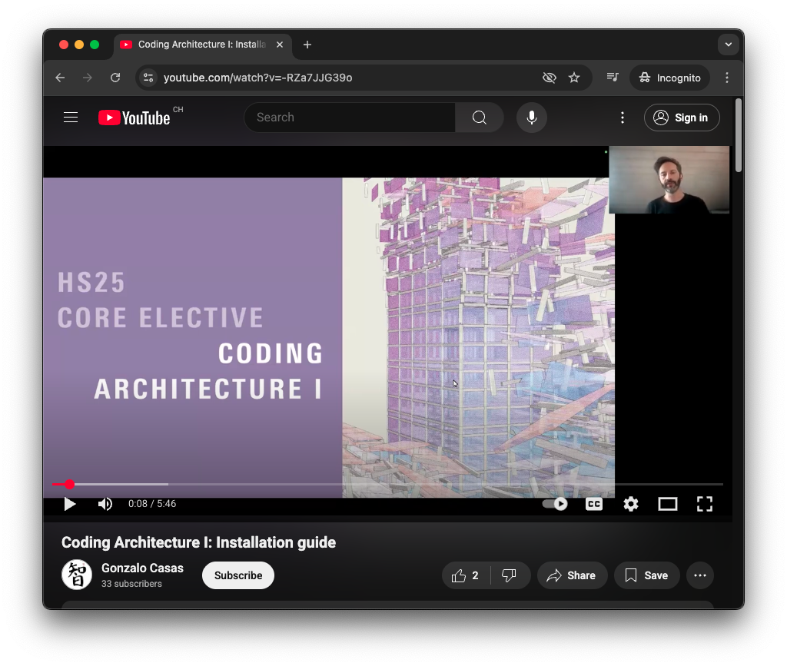

# Getting Started

## Software requirements

Before you begin the installation of the tools required for this course, make sure you have the following pre-requisites installed on your system:

* Rhino 8: https://www.rhino3d.com/download
* VS Code (free): https://code.visualstudio.com/
* GIT (free): https://git-scm.com/

> NOTE: On Mac, GIT is usually pre-installed, you do not need to install again. To check if it is installed, open a terminal window and type `git`, if the result does not indicate any error, it means you already have it in your system.

Once that is done, follow the installation instructions with this step-by-step video:

**Troubleshooting**

If you encounter issues during the installation, try to restart Rhino and retry. If the problem persists, contact your tutor.
