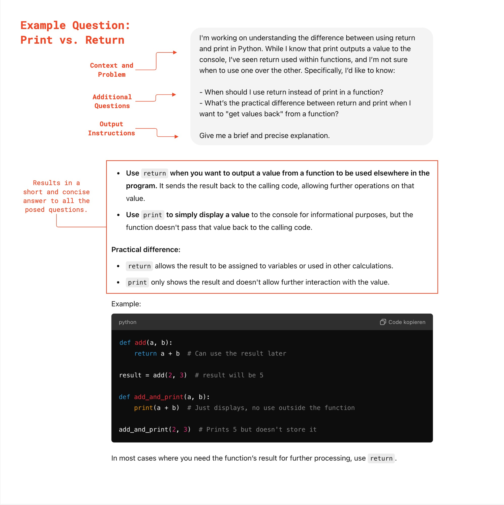
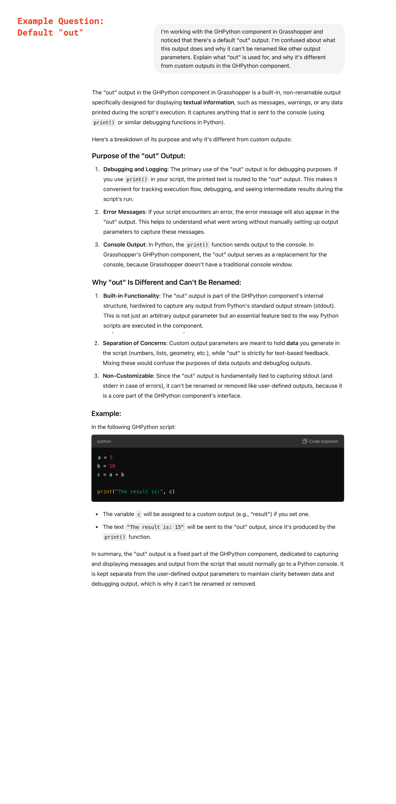
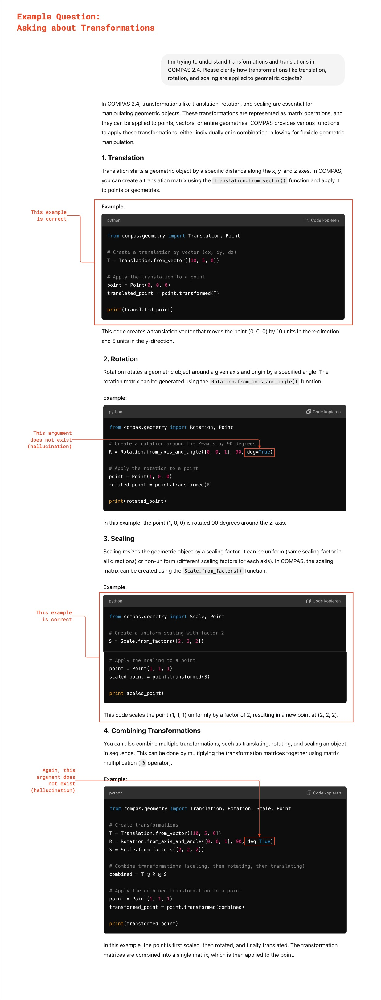

# AI Tutoring

ChatGPT, developed by OpenAI, is a language model that can generate human-like text based on user input. Most of the time, it is able to produce semantically coherent output in a vast variety of languages, including programming languages.

Usage of ChatGPT in programming has become the norm, and it definitely has the potential to enhance your learning experience by providing instant assistance and explanations on a wide range of topics. However, if not used carefully, GPT can also slow down or even hinder your learning process, or worst of all, leaving you not understanding its outputs. To help you make the most of this tool, we provide a customized GPT that is prompted to guide you in the learning process.

It is worth highlighting that while it can be very powerful aid, it can still make mistakes and you have to use it wisely. It is not a replacement for your own thinking and problem-solving skills, but rather a tool to assist you in your learning journey.

We'll take a look at how to *engineer your prompts* to get useful answers.

## Table of Contents

* [Getting Started ](#getting-started)
* [Alternative LMMs](#alternative-lmms)
* [Strategies for Good Results](#strategies-for-good-results)
  + [Write clear instructions](#write-clear-instructions)
  + [Provide reference material](#provide-reference-material)
  + [Split complex tasks into simpler subtasks](#split-complex-tasks-into-simpler-subtasks)
  + [Verify Results](#verify-results)
* [Using GPT for Tutoring](#using-gpt-for-tutoring)
  + [Example Questions](#example-questions)

## Getting Started 

To open the customized GPT for Coding Architecture tutoring, please use the following link: **[https://dfab.link/ca-hs25/gpt/](https://dfab.link/ca-hs25/gpt/)**.

You can use this GPT with a free account or a paid one:

- **Free Version**: Provides basic access to the model. It has usage limits and may be slower during peak times. The free version is available for *"unlimited"* use but has some restrictions.
- **ChatGPT Plus**: Costs around 20 CHF per month. This version uses OpenAI's most advanced model and can be used with practically no restrictions.

Both versions are capable of generating text and providing mostly accurate responses. However, while LLMs have improved a lot, they still have a tendency to generate fictional details.

## Alternative LMMs

### Text Generation

Besides ChatGPT there are many other LLMs at your disposal. While they differ on some aspects, we think any of them will serve you well. We happen to use ChatGPT as its the most commonly known one. 

* **GitHub Copilot** (by GitHub & OpenAI): An AI coding assistant integrated into development environments, free for students, designed to help with code suggestions and completions.
  * [Press here](/getting-started/github-copilot/README.md) to find out how you can use it as a student!
* **Codex**: (by OpenAI): A model specifically trained for programming tasks, capable of generating code snippets and assisting with coding-related queries. It can be installed as an extension to VS Code and you can use it with your same user as your primary ChatGPT account.
* **Claude** (by Anthropic): A conversational AI model focused on providing reliable, helpful, and safe responses, particularly emphasizing ethical AI usage. Also very capable for coding tasks, sometimes surpassing ChatGPT in accuracy.
* **Bard/Gemini** (by Google DeepMind): A conversational AI that incorporates real-time search capabilities and knowledge, designed to handle a wide range of tasks, with Gemini being its evolving successor.
* **LLaMA** (by Meta): An open-source language model that can be run locally, offering customizable models for various tasks without reliance on cloud-based services.
* **WizardCoder** (community-driven): A specialized variant of language models optimized for coding tasks, designed to assist with code generation and debugging.

### Image Generation

AI-driven image generation tools allow you to create visual content based on text prompts. These tools have become very popular in recent years for their ability to produce unique images for art, design, and creative projects. Here are some key alternatives:

- **Stable Diffusion** (by Stability AI): An open-source image generation model that can be run locally, offering flexibility for developers and users to customize outputs.
- **DALL·E** (by OpenAI): A popular image generation model known for its ability to create highly detailed and creative visuals based on text descriptions. Currently integrated directly into ChatGPT.
- **Midjourney** (by Midjourney Labs): An AI image generation tool that specializes in creating visually stunning and artistic images with a focus on unique aesthetics.

## Strategies for Good Results

GPT excels at organizing existing information into coherent text but struggles to generate new information. To achieve accurate results, it's important to formulate precise prompts. Using specific language, such as "3 units along x" instead of "more to the right," improves the model's understanding.

When dealing with complex problems, you should try to break them down into smaller, more manageable parts. Alternatively, GPT can help in breaking down the problem itself.

### Write clear instructions

ChatGPT can’t read your mind. If outputs are too long, ask for brief replies. If outputs are too simple, ask for expert-level writing. If you don't like the format, show it the format you’d like to see. The less it has to guess at what you want, the more likely you’ll get it.

* Include details in your prompt to get more relevant answers
* Ask the model to adopt a persona
* Clearly indicate distinct parts of the input (context, goal, desired output)
* Specify the steps required to complete a task (this also helps you break down the problem)
* Provide examples or files
* Specify the length or form of the output

| Bad                            | Better                  |
|-----                           |--------                 |
| How do I add numbers in Excel? | How do I add up a row of CHF amounts in Excel? I want to do this automatically for a whole sheet of rows with all the totals ending up on the right in a column called "Total".                   |
| Who’s Bundesrat?              | Who was the Bundesrat of Switzerland in 2010, and how frequently are elections held?                             |
| Write code to calculate the Fibonacci sequence. | Write a Python function to efficiently calculate the Fibonacci sequence. Comment the code liberally to explain what each piece does and why it's written that way. Explain your steps and thoughs along the way.      |
| Summarize the meeting notes.  | Summarize the meeting notes in a single paragraph. Then write a markdown list of the speakers and each of their key points. Finally, list the next steps or action items suggested by the speakers, if any. |

### Provide reference material

Language models can confidently invent fake answers (hallucinations), especially when asked about niche topics or for citations, URLs, Books or Projects. Use your intuition to guess whether or not ChatGPT can give you sensible answers on a given Topic. *It will be able to give details on the life and work of Mies van der Rohe, but it will struggle to do the same about Mike Guyer.*

- Tell ChatGPT to answer using a reference text
- Tell ChatGPT to answer with citations from a reference text

### Split complex tasks into simpler subtasks

Complex tasks tend to have higher error rates than simpler tasks. Try to break down a problem into smaller steps, or have GPT do it for you.

- Think about the steps you would take to solve the problem.
- Ask it to attempt to break down the problem itself.
- Summarize long documents piecewise and construct a full summary recursively

### Verify Results

It is important to critically reflect the output provided by GPT and not blindly trust it. When using GPT to generate code, you should carefully review it and try to understand the generated code, rather than blindly copying it. If clarification is needed, ask for it.

Luckily, the quality of the generated code can also be tested easily by checking if it behaves as intended. Still, the efficiency and simplicity of the code can be off, as GPT might use advanced programming concepts that you might not be familiar with. If that happens, ask it to rewrite the code in a beginner-friendly way.

## Using GPT for Tutoring

Following you'll find some examples we have prepared. These hightlight both the strengths and weaknesses of ChatGPT. While its answers tend to be useful, the model will dream up details, when asked about niche topics.

A common mistake that it will make is to give you answers for the wrong version of your programming language or framework.

### Example Questions

  
<b> Student Forum Question </b>

  
<b> Print vs. Return </b>

  
<b> Print vs. Return (optimized) </b>

  
<b> Default "out" </b>

  
<b> Default "out" (optimized) </b>

  
<b> Explanation of Transformations </b>

---

