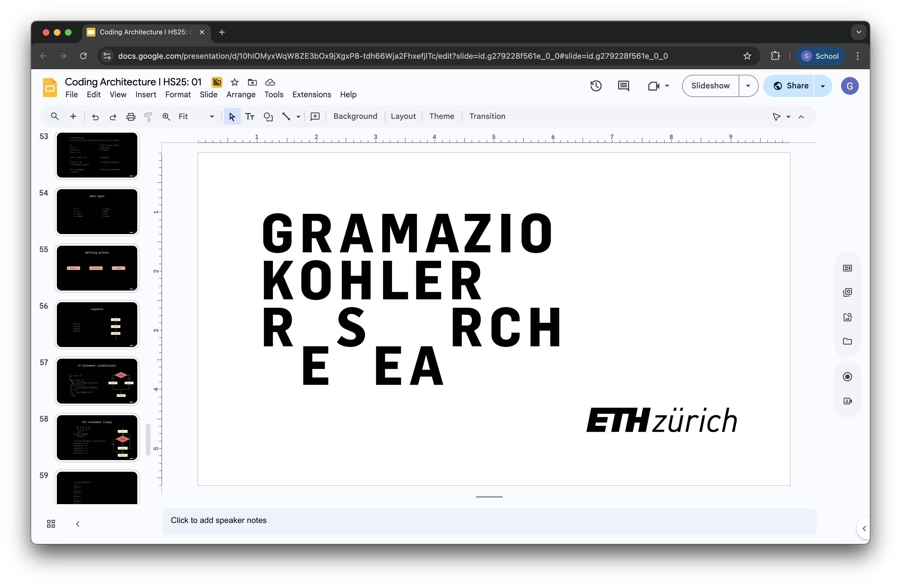
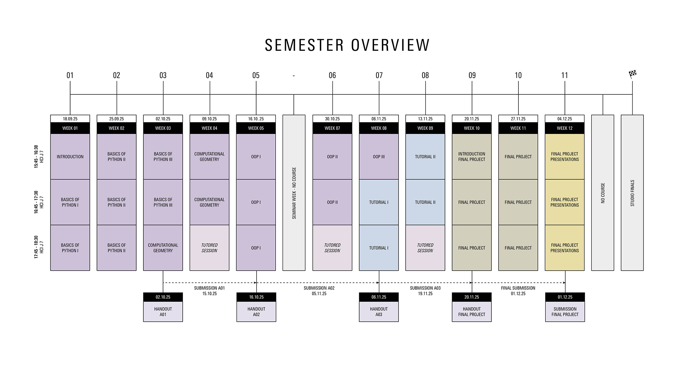
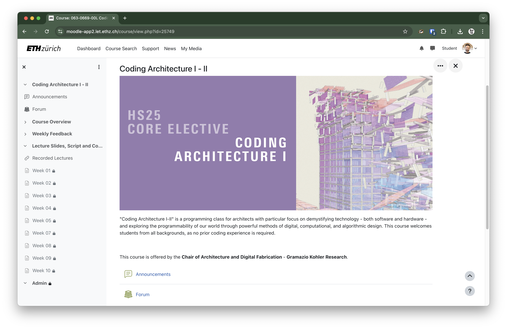

# Coding Architecture I: HS25
 
## Week 01 - Python Basics


## Table of Contents

- [Introduction](#introduction)
- [Overview](#overview)
- [Team](#team)
- [Slides](#slides)
- [Course Administration](#course-administration)
  - [Semester Structure](#semester-structure)
  - [Room](#room)
  - [Moodle](#moodle)
  - [Tutoring Groups](#tutoring-groups)
  - [Grading](#grading)
  - [Assignments](#assignments)
  - [Software Requirements and Installation](#software-requirements-and-installation)
- [Intro to Programming](#intro-to-programming)
  - [Roadmap](#roadmap)
  - [What is a software program](#what-is-a-software-program)
  - [Anatomy of Code](#anatomy-of-code)
  - [Grasshopper Introduction](#grasshopper-introduction)
- [Code Examples](#code-examples)
- [Assignment 0 (ungraded)](#assignment-0-ungraded)
- [Micro exercises](#micro-exercises)
- [Teaching Materials](#teaching-material)


## Introduction

**Coding Architecture I** is a programming class specifically designed for architects. The course focuses on demystifying technology — both software and hardware — and exploring the programmability of our world through digital, computational, and algorithmic design methods, enabling architects to grasp the fundamental principles and practical applications within our increasingly digital world.

This course is an entry point into the world of programming, with a specific emphasis on its application in architecture. You’ll learn how to use Python as the primary programming language, and we’ll work extensively with Rhino and Grasshopper to bridge the gap between text-based coding and 3D modeling. 

**Coding Architecture II**, which is available as a spring semester course will build upon the foundations laid in this course, teaching more advanced topics as well as  applications of computational architecture.

## Overview

Throughout the course, you will:

- Develop an understanding of essential programming concepts and algorithmic thinking.
- Learn to apply digital and computational methods in architectural design.
- Improve your problem-solving abilities by creating algorithmic solutions.
- Work on materializing your digital designs into the physical world.

Lectures, tutorials, and exercises will cover:

- Basic Grasshopper usage and code interaction, building on your existing knowledge.
- Basic to advanced programming skills using Python.
- Applications of Python programming within the architectural design environment.
- Practical examples of how these skills can be applied in digital fabrication and architecture.

This course welcomes students from all backgrounds, as no prior coding experience is required, but familiarity with Grasshopper is expected. By the end of the course, you’ll be equipped with tools and knowledge to incorporate digital technologies into your design processes effectively.

## Team


## Slides

[](https://docs.google.com/presentation/d/10hIOMyxWqW8ZE3bOx9jXgxP8-tdh66Wja2FhxefjlTc)

<div style="display: flex; justify-content: center; align-items: center; height: 1vh;">
    <p style="font-size: 75%;">
        ↑ click to open ↑
    </p>
</div>


## Course Administration

### Semester Structure

[](./images/course-structure.png)

The semester structure for Coding Architecture I is designed to progressively build your skills in programming and computational design. The course begins with foundational lessons in Python, gradually introducing more elaborate topics such as Object-Oriented Programming (OOP), Computational Geometry and the COMPAS framework. Each week is dedicated to a specific theme, ensuring a comprehensive understanding of the key concepts.

Assignments are strategically spaced throughout the semester, starting with simpler tasks like constructing a brick wall, and advancing to more challenging projects, culminating in a final project that integrates all the learned skills. The schedule also includes tutored sessions and review periods, providing sufficient opportunity for guided practice and feedback. 

### Room

The course “Coding Architecture I” will take place on Thurdays from 15:45-18:30 in room **HCI J7**.

> Please note:  We will try to provide as many powerplugs as we can, but we may not be able to cover the entire room! We kindly request that you bring your laptops fully charged to each session.

### Moodle

Moodle will serve as our primary teaching platform. From there, you will access all course materials, relevant administrative information, download and submission links, and quizzes. Additionally, Moodle hosts the course forum, where you can ask questions and engage in discussions with your peers and instructors.

Follow this [LINK](https://moodle-app2.let.ethz.ch/course/view.php?id=25749)
to access to the Moodle course plattform.



### Tutoring Groups


To ensure a smooth learning experience, we have assigned tutors who will act as your points of contact throughout the semester. They will be available to assist you with any content-related or administrative questions you may have. We highly recommend signing up for a tutor on Moodle as soon as possible.

LINK: [Moodle: Tutor Selection](https://moodle-app2.let.ethz.ch/mod/choicegroup/view.php?id=1241664)

### Grading 

“Coding Architecture” is a dynamic and interactive course with a strong practical hands-on approach. Hence, it is strongly recommended that you attend and actively participate in the in-person course sessions. Furthermore the course sessions incorporate step by step tutorials that are solved together in class. Understanding each step explained in these tutorial sessions is essential for successfully completing the assignments on your own. During the session you will have the possibility to ask questions and engage with tutors which will maximize your learning process throughout the course.

See [here](https://moodle-app2.let.ethz.ch/mod/page/view.php?id=1241669) for details about the grading process and your requirements.

### Assignments

The course includes four major assignments that progressively increase in complexity, allowing you to test and improve your programming abilities. These assignments cover a range of topics, from basic list and loop operations to object-oriented programming. The culmination of the assignments is a final project where you will design an entire building complex in a real architectural context in Zürich. It is recommended to complete the assignment submissions well in advance of the review session deadline, which is at noon on the day of the session.

### Software Requirements and Installation

See [here](/getting-started/README.md) for details about software requirements and installation of the tools.


## Intro to Programming

### Roadmap

The "becoming a computational designer" roadmap is a comprehensive guide that outlines the necessary steps to becoming proficient in computational design. It covers foundational concepts such as data and algorithms, as well as more advanced topics. The roadmap also provides visual references, with equivalent concepts in Grasshopper highlighted in green and programming concepts highlighted in blue below:

See [here](/roadmap/README.md) for more information about the **Roadmap: becoming a computational designer**.

[](/roadmap/roadmap.png)

<div style="display: flex; justify-content: center; align-items: center; height: 1vh;">
    <p style="font-size: 75%;">
        ↑ click to view ↑
    </p>
</div>

### What is a software program

At its core, software can be understood as a tool for transforming data. You start with input data—whether numerical values, text, or other forms of information—apply a set of operations or processes to it, and produce output data. Programming software is the task of writing that set of operations that will perform the transformation. This transformation is fundamental to all programming tasks.


Consider Excel as a simple analogy: you might have a set of numbers to which you add another set or calculate their deviation from an average. The result is a new set of numbers—your output. What occurred in between is a data transformation.

Similarly, in Grasshopper, each component operates on this principle. You provide inputs, the component processes them internally, and then you get outputs. This process of input-output transformation is at the heart of both visual programming in Grasshopper, and traditional text-based programming.

On a slightly more abstract level, software can be seen as the combination of data structures and algorithms.

>*Data structures + Algorithms = Programs*

Data structures are essentially containers that hold data of varying complexity, while algorithms are step-by-step instructions executed in a specific order to perform a task.

### Anatomy of Code

Code is fundamentally a sequence of instructions. The sequence is executed from top-to-bottom, as opposed to the flow of components from left-to-right in Grasshopper. Understanding how to read and structure code is essential, as each line of code contributes to the overall functionality of a program. In this section, we'll break down the fundamental building blocks of Python code, likening them to architectural elements to make the concepts more intuitive.

#### Python Fundamentals

Just as bricks can be conceived of as the basic units of a building, the following elements are the minimal building blocks of Python code. Each element, whether a comment, data type, or basic expression, plays a crucial role in constructing a functional program.

```python
# -----------------------------------
# ------------ Comments -------------

# Single line comments start with a hash.

"""
This is a multi-line comment.
It can span multiple lines.
Ideal for longer descriptions.
"""

# -----------------------------------
# ----------- Data Types ------------

# Integer: Whole numbers without a decimal point.
integer_example = 42

# Float: Numbers that include a decimal point.
float_example = 4.2429

# String: A sequence of characters in either single or double quotes.
string_example = "42"
string_example_2 = "Hello World"

# Boolean: Represents two values: True or False.
boolean_example = True
```

#### Expresions and Statements

Think of expressions and statements as the walls that structure your code. They allow you to perform operations and store the results, giving your code a defined structure and purpose.

```python
# ------------------------------------
# ----------- Expressions ------------

# Expression: A combination of values, variables, operators
# and functions that create a new value. 

# A value alone is itself a valid expression.
3.14

# This expression multiples two values with the * operator.
42 * 10                       # but we are not using the result!

# Expressions work similarly to math, e.g. parentheses to group parts
(42 * 10) / 2.5

# We can also combine with variables
integer_example / 2         # Divide the value of integer_example by 2

# -------------------------------------
# ------- Assignment Statements -------

# An assignment statement is an instruction that stores a value in a variable.

a = 10                        # Assigns the integer 10 to variable named a

# Assigning the result of an expression to a variable
b = a * 2                     # Multiplies a by 2 and stores the result in b

# -------------------------------------
# ------------ Statements -------------

# More generally, statements are instructions (usually a single line)
# that Python can execute and they cause a side effect. 

# A sequence of 3 statements to: assign a variable, print it and print its double
x = 42
print(x)
print(x * 2)

```

#### Control Flow Statements and Functions

Control Flow Statements and Functions help you direct the flow of the program and define reusable algorithms. They allow you to build more complex and organized programs.

Unlike a set of statements in a script, the statements inside a function only run when the function is called.


```python
# -------------------------------------
# ------ Control Flow Statements ------

# Conditional (if) statement
if b > 10:
    print("b is greater than 10")

# A loop of a fixed number of iterations
for i in range(5):
    print(i)                   # Prints numbers 0 to 4

# A loop that iterates while a specified condition is true
# WARNING: always ensure the condition will eventually be false, otherwise, Grasshopper will freeze!
count = 0
while count < 5:
    print(count)
    count += 1                # Prints numbers 0 to 4, incrementing count each time

# ----------------------------
# --------- Functions --------

# Using one of many built-in functions in Python
largest_value = max(20, 5, 133)

# Some functions need to be "imported" first
# The imports are usually done at the beginning of the script
from math import sqrt
sqrt_example = sqrt(64)       # Calculates the square root of 64

# We can also define our own functions!
# Defining a simple function with two parameters
def add_numbers(x, y):
    return x + y              # Returns the sum of x and y

# Calling a function
result = add_numbers(5, 3)
print(result)                 # Prints 8

```

#### Algorithms

Just as a building is composed of bricks, beams, and walls, a Python program is constructed from comments, data types (values), expressions, statements, control structures, and functions. 

Defining an algorithm simply means that we will combine all these elements and organize them in a way they can be reused. This is the essence of programming.

Each of these elements is a building block that allows the creation of the next level, i.e.: `Values -> Expressions -> Statements -> Algorithms`. 

```python

if value < 0:                   # an algorithm! 
    print(value * -1)
else:
    print(value)

```

Once we have defined an algorithm, we want to make it reusable! To do that, we can wrap it in a function:

```python
def abs(value):              # function (aka definition)
    if value < 0:            # .. wraps an algorithm in a 
        return value * -1    # .. reusable building block
    else:
        return value

# Use it!
print(abs(-222))

```

### Grasshopper Introduction

Grasshopper is a visual programming language and environment for Rhinoceros3D. It is commonly used in computational design and architecture to create parametric models and generative designs. We want to draw a parallel here to our ["conception of programming"](#what-is-a-software-program), where we postulated that an *input* is somehow transformed by a *process*, resulting in an *output*.

By connecting components and algorithms in Grasshopper's visual interface, you can manipulate geometry, automate tasks, and explore design alternatives. To learn more about Grasshopper and its capabilities, refer to the [Teaching Material](https://gramaziokohler.arch.ethz.ch/teaching-materials/) section for in-depth resources and links.


## Code Examples

The following example files will guide you in understanding the concepts presented during the lecture.

- [Anatomy of Code](./examples/00_anatomy_of_code_hs25.gh)
- [Overview of Arithmetic Operators](./examples/01_arithmetic_operations_hs25.gh)
- [Overview of Other Operators](./examples/02_operators_hs25.gh)

## Assignment 0 (Ungraded)

The assignment of this week is ungraded. You can give it a try to practice arithmetic operations in Python within the context of Grasshopper.

### Calculator

The task of the first (ungraded) assignment is to create a simple calculator program that can perform four basic arithmetic operations: addition, subtraction, multiplication, and division. 

Click the link [here](/assignments/A00-ungraded-assignment/README.md) to learn the details of the first assignment.

## Micro exercises

The following are very simple optional micro exercises that you can go through to practice some of the concepts of the current lecture. Each of them should not take more than 5 minutes to complete.

1. In a "Python 3 Script" component, write a program that assigns a float value to the variable `height` and then print it.

2. In a "Python 3 Script" component, write a program that assigns two variables named `x`    and `y` with float values and then prints the sum them.

3. In a "Python 3 Script" component, write a program that assigns a string value to the variable `name` and then prints it.

4. In a "Python 3 Script" component, write a program that assigns a float value to the variable `x`, then use conditional statements to check if it's greater than 5, if it is, print the string `"Is a large value"`.

<details>
  <summary><b>Solutions</b></summary>

1. 

```python
height = 1.75
print(height)
```

2. 
    
```python
x = 10.5
y = 20.2
print(x + y)
```

3. 

```python
name = "David Bowie"
print(name)
```

4. 

```python
x = 10
if x > 5:
    print("Is a large value")
```

</details>

## Teaching Material

We have compiled a list of essential links and resources to support your learning throughout the semester. These materials cover foundational topics in programming, computational geometry, visual programming, Rhino, and Grasshopper. You will also find API references that include the methods, classes, and functions needed for your assignments and projects. Additionally, we've included a selection of books and other resources to help you deepen your understanding of the course topics. These resources are intended to provide you with the necessary tools and information as you progress through the course.

### Foundational Material

- [Essentials of Parametric Design](https://gramaziokohler.arch.ethz.ch/teaching-materials/01_essentials/)

### Rhino

- [Rhino User Guide](https://docs.mcneel.com/rhino/8/usersguide/en-us/index.htm)
- [Rhino Command List for 3D Modelling](https://docs.mcneel.com/rhino/8/help/en-us/commandlist/command_list.htm)
- [RhinoScript Syntax](https://developer.rhino3d.com/api/RhinoScriptSyntax/)
- [RhinoCommon API Reference](https://developer.rhino3d.com/api/rhinocommon/?version=8.x)
- [Rhino Python Guide](https://developer.rhino3d.com/guides/rhinopython/)

### Grasshopper

- [Grasshopper Guides](https://developer.rhino3d.com/guides/grasshopper/)

### Python

- [Python 3.9 Reference](https://docs.python.org/3.9/)
- [Python Roadmap](https://roadmap.sh/python)
- [Python Cheat Sheet](https://learnxinyminutes.com/python/)

### COMPAS

- [COMPAS API Reference](https://compas.dev/compas/2.14.1/api/index.html)


### Books

For online access using your ETH Account, you have to be in the ETH network or VPN.

- [Geometric Computation: Foundations for Design](https://www.taylorfrancis.com/books/mono/10.4324/9781315765983/geometric-computation-foundations-design-joy-ko-kyle-steinfeld). Ko, Joy, and Kyle Steinfeld. London: Routledge, 2018.
Online access with ETH Account: Link
[ Copy available at ETH Architecture and Civil Engineering Library ]  ISBN : 1-317-65907-4
- [Morphing: a Guide to Mathematical Transformations for Architects and Designers](https://www.oreilly.com/library-access/?next=/library/view/morphing/9781780677224/). Choma, Joseph. London: Laurence King Publishing, 2015.
Online access with ETH Account: Link
[ Copy available at ETH Architecture and Civil Engineering Library ] ISBN : 1780674139
- [AAD_algorithms-Aided Design: Parametric Strategies Using Grasshopper®](https://www.arturotedeschi.com/books). Tedeschi, Arturo, and Fulvio Wirz.  Brienza (Potenza): Le Penseur, 2020.
ISBN : 9788895315300
- [Digital Media Series: Grasshopper](https://www.jinmorhee.net/jinmorhee_2-multiimage/dmsgrasshopper.html). Jinmo Rhee, Eddy M. Kim. Independently published. ISBN :  979-8650408130

### Video recordings

The lecture recordings will be available on the ETH Video Portal to serve as reference, however, presence during lectures is required.

---

<p align="middle">

</p>