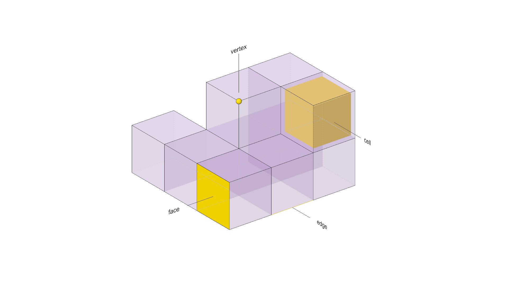
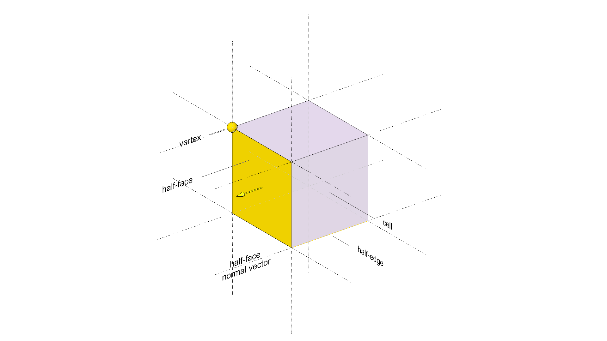

# Coding Architecture I: HS25

## Week 07 - Datastructures


## Table of Contents

* [Overview](#overview)
* [Slides](#slides)
* [Content](#content)
    + [Recap](#recap)
    + [Principles of OOP](#principles-of-oop)
    + [Data structures](#data-structures)
        - [**Graph**](#graph)
        - [**Mesh**](#mesh)
        - [**VolMesh**](#volmesh)
    + [Vector arithmetic and friends](#vector-arithmetic-and-friends)
* [Code Examples](#code-examples)

## Overview

This week we will recap on object-oriented programming and dig deeper into it, focusing on some specific data types that we will refer to as data structures. Data structures ease the process of managing data, there are many different data structures, but our scope for this week will be an overview of 3 main ones available in COMPAS, namely `Graph`, `Mesh` and `VolMesh`.

Using the latter, we will rebuild our box grid exercise from previous lectures, this time using `VolMesh` as our main container of data, which will give us the posibility of "asking it" questions.

>**Learning Goals:** Apply classes to start the structure of the next assignments and final project.


## Slides

[](https://docs.google.com/presentation/d/1njpdiRf3y2nqcWP-wiYc9fBp8aifzcJ02tydTMbRtbI)

<div style="display: flex; justify-content: center; align-items: center; height: 1vh;">
    <p style="font-size: 75%;">
        ↑ click to open ↑
    </p>
</div>

## Content


### Recap

We have seen how to define single data values, list (and other collections) of data values, how to define geometry data types, and how to define behavior (algorithms) encapsulated into functions.

Object-oriented programming allows us to create new data types that combine the data and the behavior into one bundle. They encapsulate everything that belongs together inside of them. They act as blueprints that we can use to create new instances (objects) of the same type.

```python
# ---------------------------------------------
# --- defining data: single/multiple values ---


a = 42                            # integer
b = 3.14                          # float
c = True                          # bool
d = "Hello"                       # string

values = [1, 2, 3, 4, 5]          # explicit list
values = range(6)                 # computed list
```

```python
# ---------------------------------------------
# ------ defining data: geometric types -------
# -------------- using COMPAS  ----------------

from compas.geometry import Point
from compas.geometry import Box

point = Point(1, 0, 0)
box = Box(2.0, 1.0, 0.6)
```


```python
# ---------------------------------------------
# ------ defining behavior: functions ---------

def is_even(number):
    if number % 2 == 0:
        return True
    else:
        return False

print(is_even(2))
print(is_even(3))
```

```python
# ---------------------------------------------
# ---- defining data + behavior: new types ----

class Room:
    def __init__(self, name, height, color):
        self.name = name
        self.height = height
        self.color = color

    def paint(self, new_color):
        self.color = new_color
```

### Principles of OOP

There are four principles of object-oriented programming:

1. **Abstraction: Hiding Details**

   Abstraction is like the blueprints you would create for a building. You only show the main parts needed to understand (e.g. rooms, walls, and doors), but normally you don't add every tiny detail, like nails or screws.

   In programming, **abstraction** means only showing the necessary parts to people using your code. They don’t need to know all the tiny details inside; they just see what they need to work with. Python uses conventions to denote things that are implemenetation details: if a variable, attribute, or function name starts with an understand (not with two!), that means it's inteded to be a `private` implementation detail.

2. **Encapsulation: Keeping Things Together**

   When we design a room, we decide where the walls go and what will be inside the room. We keep everything about that room (its furniture, doors, windows) inside that room. This is encapsulation: keeping things that belong together in one place and not letting random stuff from other rooms wander in.

   In programming, encapsulation is about keeping data and behavior (e.g. functions) together in one place, so things don’t get mixed up. This helps keep everything organized.

3. **Inheritance: Passing Down Features**

   Once we designed a room, we might realize we also need other types of rooms, but they share a lot of similarities to our first room design and only add a few extra features.

   Inheritance in programming lets us create a blueprint of a data type for a generic room, and then make new room blueprints that are based on our original one. They inherit the basics but allow us to add extras when needed. This way, we don’t have to start over each time.

4. **Polymorphism: Acting Differently according to the Situation**

   Imagine that each room has a light switch, but some rooms need different types of lighting.

   Polymorphism means that even though every room has a light switch, each room can make that switch work a bit differently depending on what kind of room it is. In programming, this allows us to use the same functions in different situations, and the code will adapt depending on what it is controlling.

### Data structures

Once we become more familiar with object-oriented programming, we start noticing that everything in Python is an instance of a class. Some classes are very simple, and some others are more sophisticated and provide a neater way to access, and organize the data contained in them. The list is an example of such a data structure, because it allows us to group together items in a sequence, and append, remove, slide, index and all sort of operations.

In general, data structures are classes that provide an advantange to access data (either faster, easier, or some other way).

The COMPAS frameworks provides a few interesting data structures as well, today we will mention three of them and focus on one of them:

#### **Graph**

A graph is a classic data structure that allows to keep a set of nodes and their relationships as the connected edges between them.

The implementation in COMPAS also allows adding custom attributes at the graph, node and edge level, as well as translating to and from `NetworkX` (another popular graph library for Python).

#### **Mesh**

While you are most likely familiar with meshes, the one in COMPAS provides some additional benefits. The first one is that it is CAD agnostic, it means you can do mesh processing outside of Rhino, or any other CAD for that matter. It is based on a half-edge data structure concept (unlike the mesh of Rhino), and supports for n-sided polygonal faces, open or closed polygonal surfaces.

Just like the graph, this data structure allows adding custom attributes at the mesh, vertex, edge and face levels.

#### **VolMesh**

This data structure represents volumetric meshes consisting of a set of polyhedra, i.e cells. A polyhedra is a three-dimensional shape with flat polygonal faces, straight edges, and sharp corners or vertices.




Similarly to the mesh, the `VolMesh` is CAD agnostic, it's based on the concept of half-face data structures, and it allows adding custom attributes at the volmesh, vertex, edge, face and cell levels.

VolMeshes do not have to be orthogonal, but we will use an orthogonal one for our following exercises for the sake of simplicity.

The main benefit of using a data structure like this for our building grid is that after we create it, we can also retrieve data from it that is more meaningful than just pure geometry. For example, we can ask the volmesh to give us all cells that are on boundaries, or the neighbors of any given cell, or cull unused vertices, and in general, keeps everything neatly organized.

### Vector arithmetic and friends

The COMPAS framework allows us to perform many different operations with its geometric types. It's useful to brush up on some of these concepts.

Point arithmetic has the particularity that addition and subtraction are not symmetric, adding points results in a new point, but subtracting points results in a vector. Many 3d processing libraries do the same.

```python
p1 = Point(1, 0, 0)
p2 = Point(3, 0, 0)

# Add points
print(p2 + p1)
>> Point(x=4.0, y=0.0, z=0.0)

# Subtract points
print(p2 - p1)
>> Vector(x=2.0, y=0.0, z=0.0)
```

Vector can also be operated on, adding and subtracting vectors, unitizing them, etc.

```python
u = Vector(1, 0, 0)
v = Vector(0, 1, 0)

# Add two vectors
print(u + v)
>> Vector(x=1.0, y=1.0, z=0.0)
```


```python
u = Vector(1, 0, 0)
v = Vector(0, 1, 0)

# Subtract two vectors
print(u - v)
>> Vector(x=1.0, y=-1.0, z=0.0)
```


```python
u = Vector(1, 0, 0)

# Unitize vector
print((u * 2).unitized())
>> Vector(x=1.0, y=0.0, z=0.0)
```


There are two very useful operations on vectors that we will need a lot: dot product and cross product.

```python
u = Vector(1, 0, 0)
v = Vector(0, 1, 0)

# Dot product (measure angle, 0=perp, 1=parallel, -1=opposite)
print(u.dot(v))
>> 0.0

# Cross product (perpendicular vector) 
print(u.cross(v))
>> Vector(x=0.0, y=0.0, z=1.0)
```

1. The **dot product** of two vectors results in a float, it is a measure of the angle between the two vectors. If the result is `0`, it means the two vectors are perpendicular, if it is `1` (positive), they are parallel running in the same direction, and if it's `-1` (negative), they are parallel but running in opposite directions.


2. The **cross product** of two vectors is a new vector that is perpendicular to them.


## Code Examples

The following files are useful to follow the lecture content:

- [Geometry and datastructures](./examples/01-geometry-and-datastructures_hs25.gh) 
- [Building grid tutorial](./examples/02-building-grid-tutorial-01_hs25.gh)
- [Building grid tutorial: solution](./examples/02-building-grid-tutorial-01_hs25_solution.gh)

---

<p align="middle">

</p>