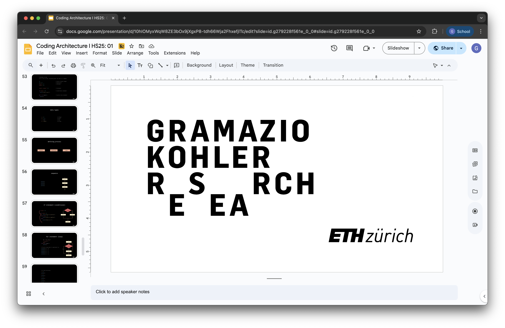

# Coding Architecture I: HS25

## Week 09 - Facades and Attractors

## Table of Contents

* [Overview](#overview)
* [Slides](#slides)
* [Tutorials](#tutorials)
* [Attractor Exercise](#attractor-exercise)

## Overview

This week we’re programming the final components of our building grid. We’ll finish our structure by adding facades, completing the primary architectural elements. Using the VolMesh data structure, we’ll find methods to create these elements dynamically.

We'll also revisit attractor points as a way to introduce a bit of creativity, allowing for design adjustments across facade elements based on the proximity to these points.

>**Learning Goals:** Develop flexible facade classes within the VolMesh framework, exploring how architectural elements interact structurally and spatially.

## Slides

    

        ↑ click to open ↑
    

## Tutorial Series

We’ll complete our building element classes by creating **facades** within the building grid, using the VolMesh data structure. Additionally, we will implement **attractor points** to add variability to the facade expression as well as height adjustments.

The following files are useful to follow the lecture content:

- [Building grid: Tutorial Facades](/lectures/week-09/examples/01-building-grid-facade_hs25.gh)

## Attractor Exercise

The goal of this exercise is to implement simple methods to experiment with the building/facade design and learn how to create and use attractors.

Use the files below to do the exercise:

- [Attractors: tiny exercise](/lectures/week-09/examples/attractors_hs25.gh)
- [Attractors: tiny exercise solution](/lectures/week-09/examples/attractors_solution_hs25.gh)

---

