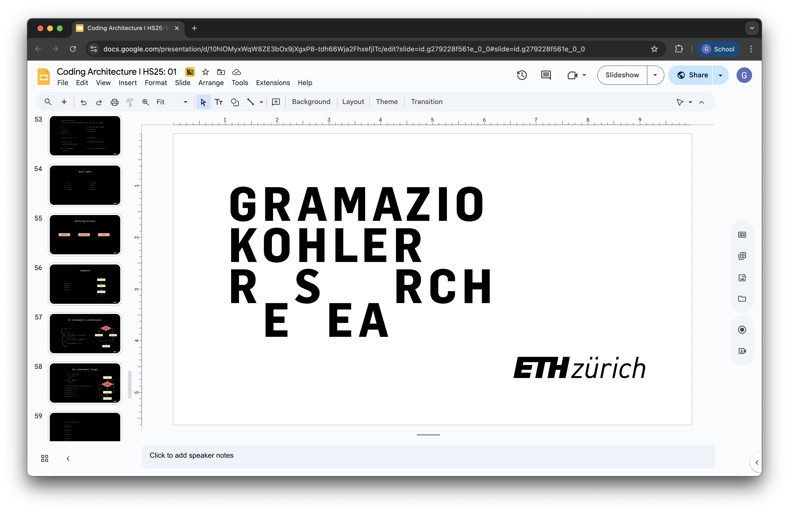

# Coding Architecture I: HS25

## Week 10 - Final Project

## Table of Contents

* [Overview](#overview)
* [Slides](#slides)
* [Final Project](#final-assignment)

## Overview

In Week 10, we will introduce the final project, where you will apply all the concepts learned throughout the course to design a comprehensive building structure.

>**Goal:** integrate all knowledge gained during the assignments into a more complete building structure.

## Slides

    

        ↑ click to open ↑
    

## Final Assignment

### Design Project

In this final assignment, you will integrate all the concepts learned throughout the course into a comprehensive building structure. Using Python programming, you will create a building that incorporates architectural components such as slabs, columns, and facade walls, sculpted by a filter class.

Your building will be placed in a real location in the city of Zurich. You can choose one of the following five plot locations for your design project: **Altstetten**, **Hardturm**, **Letzi**, **Heinrich-Areal**, or **Escher Wyss**. Each location has unique characteristics and potential constraints, so consider factors like plot size, shape, and local context when making your choice.

[→ CLICK HERE ← to access the final task description.](../../assignments/A04-final-project/README.md) 

---

